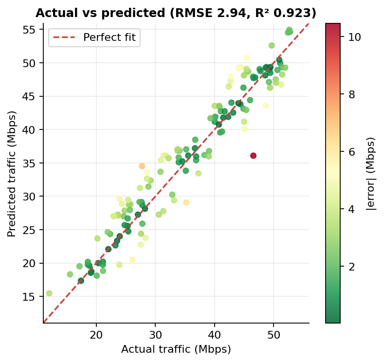
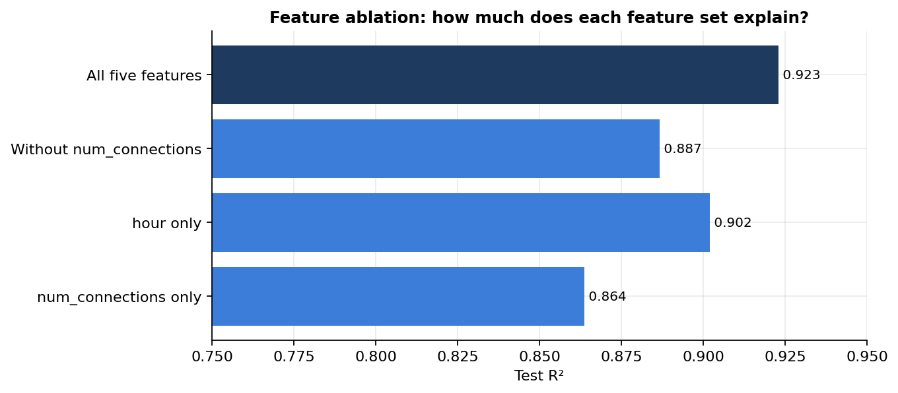
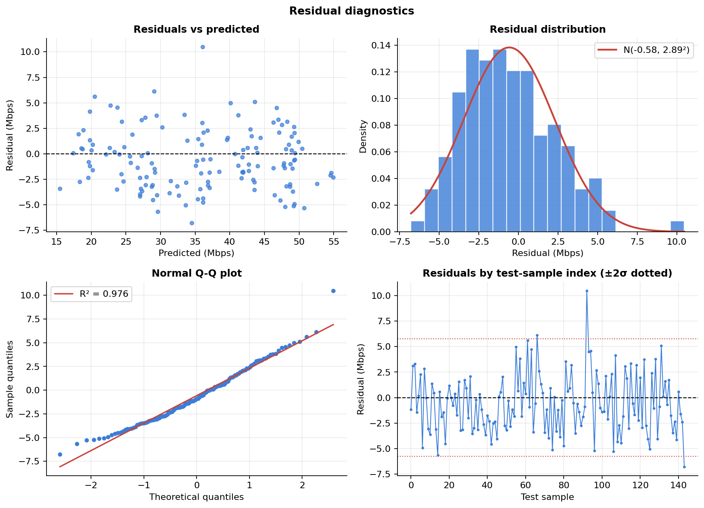
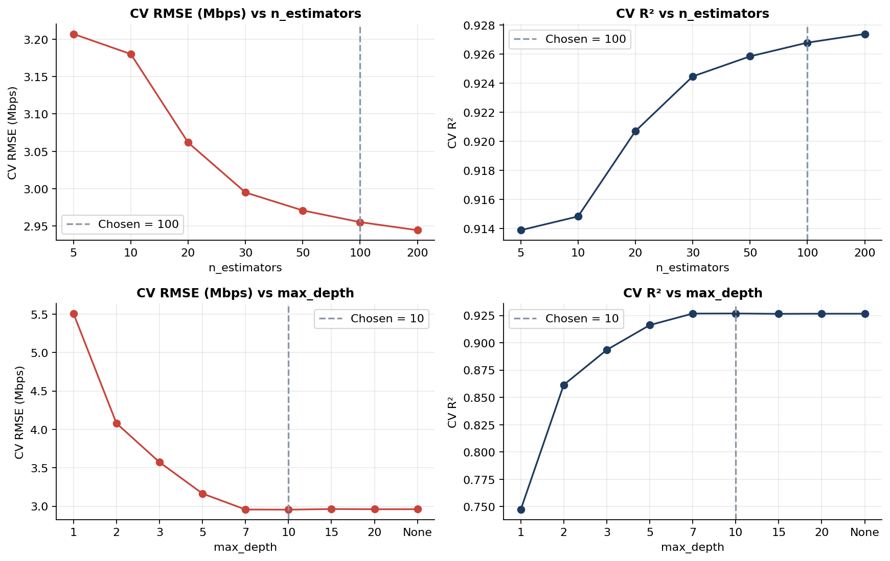
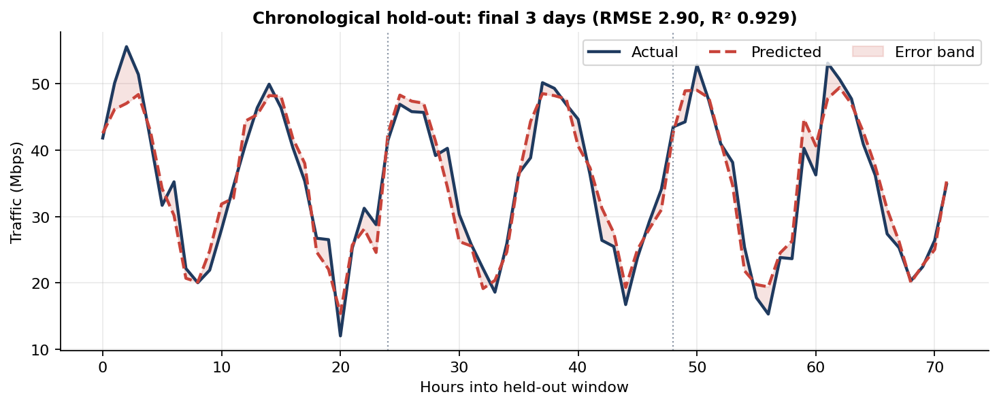

# Network Traffic Volume Prediction with Random Forest Regression

[](https://github.com/<your-username>/network-traffic-forecasting/actions)


Can you predict how much traffic a campus network will carry in a given hour, using only lightweight monitoring statistics? This project builds and critically evaluates a Random Forest regression model for that question, and, just as importantly, tests where the model's apparent success comes from.

I developed it for the course *Data Science for Communication Networks* (21ECE375T, B.Tech ECE with specialisation in Data Science, SRM Institute of Science and Technology, Vadapalani), supervised by Dr. B. Priyadharshini. This repository is the cleaned-up, fully reproducible version of that work: every number and figure below is generated by the code in this repo.

---

## Results at a glance

Hourly throughput (Mbps) predicted from five features, on 720 simulated records (576 train / 144 test).

| Model | RMSE (Mbps) | MAE (Mbps) | R² |
|---|---:|---:|---:|
| Linear Regression | 4.072 | 3.509 | 0.853 |
| Decision Tree (depth 10) | 4.075 | 3.025 | 0.852 |
| **Random Forest (100 trees, depth 10)** | **2.943** | **2.410** | **0.923** |

Robustness checks on the Random Forest:

| Evaluation | RMSE (Mbps) | R² |
|---|---:|---:|
| Random 80/20 test split | 2.943 | 0.923 |
| 10-fold cross-validation (training set) | 2.895 ± 0.266 | 0.928 ± 0.013 |
| **Chronological hold-out** (train days 1–27, predict days 28–30) | 2.902 | 0.929 |

The model cuts RMSE by roughly 28% relative to either baseline, and the score barely moves under cross-validation or a forward-in-time split, so the result is not an accident of one lucky partition.



## What I learned (the more interesting part)

**1. Connection count is the strongest single signal, but not by as much as it first appears.**
Impurity-based importance gives `num_connections` 0.915 and `hour` 0.056. Permutation importance on the test set agrees on the ranking. However, the ablation study tells a more nuanced story:

| Feature set | Test R² |
|---|---:|
| All five features | 0.923 |
| `hour` only | 0.902 |
| Without `num_connections` | 0.887 |
| `num_connections` only | 0.864 |

The hour of day alone beats connection count alone. In this dataset, the two features carry overlapping information, and the forest gets its best results by combining them. Importance rankings describe how a *fitted model* spends its splits, not how much unique information a feature holds. The ablation is the better guide.



**2. Errors are small and well-behaved, with one mild bias.**
Residuals are roughly Gaussian (Q-Q R² = 0.976) with no funnel shape against the predictions. The mean residual is −0.58 Mbps, so the model slightly over-predicts on this test split, which is small but not zero. Mean absolute error is lowest at low traffic (1.46 Mbps for 10–20 Mbps) and sits around 2.3–2.6 Mbps elsewhere.



**3. Hyperparameters are not delicate.**
Cross-validated R² saturates by `max_depth` ≈ 7 and shows only marginal gains beyond roughly 100 trees, so the chosen configuration (100 trees, depth 10) is a sensible, cheap operating point.



**4. A forward-in-time test matters for forecasting claims.**
A random split lets the model see neighbouring hours from the same day during training. The chronological hold-out removes that advantage, and performance holds up.



## Dataset

A simulated 30-day campus network log with one record per hour (30 × 24 = 720 rows).

| Feature | Type | Description |
|---|---|---|
| `hour` | int | Hour of day, 0–23 |
| `num_connections` | float | Connection requests in the hour |
| `avg_packet_size` | float | Mean packet size, 500–1500 bytes |
| `protocol` | binary | Dominant protocol: 0 = TCP (80%), 1 = UDP (20%) |
| `duration` | float | Mean connection duration, 0.5–10 s |
| `traffic_mbps` | float | **Target:** aggregate throughput |

The data is generated by `src/traffic_rf/data.py` with a fixed seed and also saved to `data/campus_traffic_hourly.csv`. Please read the [limitations](#limitations) before drawing conclusions about real networks.

## Method

1. **Data generation** with a smooth daily traffic profile plus Gaussian noise.
2. **Preprocessing**, as a scikit-learn `Pipeline`: IQR clipping (k = 1.5) on continuous features, then Min-Max scaling. Both are fitted on training data only, so nothing leaks from the test set, including inside cross-validation.
3. **Model:** `RandomForestRegressor(n_estimators=100, max_depth=10, random_state=42)`.
4. **Evaluation:** RMSE, MAE and R² on a held-out test set; 10-fold CV; a chronological hold-out; learning curve; hyperparameter sweeps; residual diagnostics; partial dependence; permutation importance; feature ablation.

More detail is in [`docs/METHODOLOGY.md`](docs/METHODOLOGY.md).

## Repository structure

```
.
├── src/traffic_rf/
│   ├── config.py          # seeds, feature lists, hyperparameters
│   ├── data.py            # synthetic dataset generator
│   ├── preprocessing.py   # IQRClipper, scaling pipeline, splits
│   ├── models.py          # Random Forest + baseline factories
│   ├── evaluation.py      # metrics, CV, sweeps, learning curve, ablation
│   ├── plotting.py        # all 13 figures
│   └── pipeline.py        # end-to-end experiment
├── scripts/run_experiments.py
├── tests/                 # pytest suite (13 tests)
├── docs/                  # methodology and limitations
├── data/                  # generated dataset (CSV)
├── results/               # metrics.json and figures/
└── .github/workflows/ci.yml
```

## Quickstart

```bash
git clone https://github.com/<your-username>/network-traffic-forecasting.git
cd network-traffic-forecasting
python -m venv .venv && source .venv/bin/activate
pip install -r requirements-dev.txt

python scripts/run_experiments.py   # regenerates data, metrics.json and all figures
pytest -q                           # runs the test suite
```

The run takes well under a minute on a laptop and is deterministic (seed 42).

## Limitations

I want to be upfront about what this project does and does not show. The full discussion is in [`docs/LIMITATIONS.md`](docs/LIMITATIONS.md); the short version:

- **The data is synthetic.** The results show that the pipeline works, not that the model would reach R² ≈ 0.92 on real campus traffic.
- **`num_connections` is partly built from the target** in the generator (connections ≈ traffic × U(8, 12)), which inflates its apparent usefulness. This is why I added the ablation study rather than relying on importance scores alone.
- **The daily pattern is a stylised sinusoid** (peaks near 02:00 and 14:00 in this simulation), not a calibrated model of real diurnal behaviour.
- **No lag features or autocorrelation modelling,** so this is a feature-based regression rather than a full time-series forecaster.

## Future work

- Validate on real packet-capture-derived traffic (e.g. MAWI or CAIDA traces).
- Add lagged-traffic features and compare against ARIMA/Prophet and an LSTM for multi-hour horizons.
- Replace the leakage-prone `num_connections` construction with an independent generative process, then re-run the ablation.
- Add SHAP values for per-prediction explanations and prediction intervals (e.g. quantile forests).
- Prototype integration with an SDN controller for threshold-based congestion alerts.

## References

1. L. Breiman, "Random Forests," *Machine Learning*, 45(1), 5–32, 2001.
2. F. Pedregosa et al., "Scikit-learn: Machine Learning in Python," *JMLR*, 12, 2825–2830, 2011.
3. T. Nguyen and G. Armitage, "A Survey of Techniques for Internet Traffic Classification using Machine Learning," *IEEE Communications Surveys & Tutorials*, 10(4), 2008.
4. C. Molnar, *Interpretable Machine Learning*, 2nd ed., 2022.

## Author

**Lohitashva V.S**, B.Tech, Electronics and Communication Engineering (Data Science specialisation), SRM Institute of Science and Technology, Vadapalani.
📧 `your.email@example.com` · 🔗 [LinkedIn](https://www.linkedin.com/in/your-profile)

Released under the [MIT License](LICENSE).
